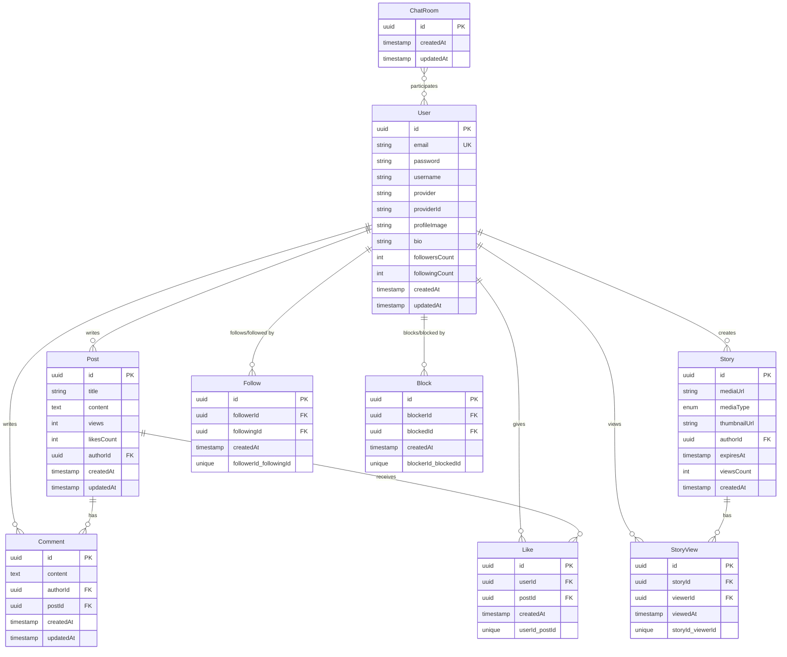

# Board 프로젝트 종합 리포트

> 크래프톤 정글 10기 - 소셜 미디어 플랫폼 프로젝트
> 작성일: 2025년 1월

---

## 목차

1. [프로젝트 개요](#1-프로젝트-개요)
2. [제공 서비스 및 기능](#2-제공-서비스-및-기능)
3. [기술 스택 및 선택 이유](#3-기술-스택-및-선택-이유)
4. [프론트엔드 최적화](#4-프론트엔드-최적화)
5. [백엔드 최적화](#5-백엔드-최적화)
6. [시스템 아키텍처](#6-시스템-아키텍처)
7. [개선점](#7-개선점)

---

## 1. 프로젝트 개요

**Board**는 인스타그램과 유사한 소셜 미디어 플랫폼으로, 게시글 공유, 실시간 채팅, 24시간 스토리, 팔로우 시스템 등을 제공하는 풀스택 웹 애플리케이션입니다.

### 주요 특징
- 🎨 모던한 UI/UX with Tailwind CSS
- 🌙 다크모드 지원
- ⚡ 실시간 양방향 통신 (WebSocket)
- 🔐 JWT 기반 인증 시스템
- 📦 Docker 기반 마이크로서비스 아키텍처
- 🚀 성능 최적화된 데이터베이스 쿼리

---

## 2. 제공 서비스 및 기능

### 2.1 인증 및 사용자 관리

#### 2.1.1 회원 가입 및 로그인
- **로컬 인증**: 이메일/비밀번호 기반 회원가입 및 로그인
- **비밀번호 암호화**: bcrypt 해싱 (보안)
- **JWT 토큰**: Access Token 기반 인증
- **OAuth 지원 준비**: Kakao OAuth 제공자 필드 구현 (provider, providerId)

#### 2.1.2 프로필 관리
- 프로필 이미지 업로드 및 변경
- 사용자 정보 수정 (username, bio, profileImage)
- 프로필 조회 (본인 및 타 사용자)
- 팔로워/팔로잉 수 실시간 표시

### 2.2 게시글 (Posts) 서비스

#### 2.2.1 게시글 CRUD
- **생성**: 제목, 내용 작성
- **조회**:
  - 전체 게시글 목록 (페이지네이션)
  - 특정 게시글 상세 조회
  - 조회수 자동 증가
- **수정**: 작성자만 수정 가능
- **삭제**: 작성자만 삭제 가능 (CASCADE로 댓글도 함께 삭제)

#### 2.2.2 게시글 추가 기능
- **좋아요 시스템**: 게시글 좋아요/취소, 좋아요 개수 캐싱
- **댓글 시스템**: 게시글에 댓글 작성/수정/삭제
- **페이지네이션**: 효율적인 목록 조회 (page, limit 파라미터)
- **작성자 정보 JOIN**: N+1 문제 방지를 위한 leftJoinAndSelect

### 2.3 댓글 (Comments) 서비스

#### 2.3.1 댓글 CRUD
- 댓글 작성 (POST /comments)
- 게시글별 댓글 조회 (GET /comments/post/:postId)
- 댓글 수정 (PATCH /comments/:id)
- 댓글 삭제 (DELETE /comments/:id)

#### 2.3.2 댓글 특징
- 작성자 정보 포함
- 생성/수정 시간 자동 기록
- 게시글 삭제 시 자동 삭제 (CASCADE)

### 2.4 좋아요 (Likes) 서비스

#### 2.4.1 좋아요 기능
- 게시글 좋아요 추가/취소 (토글)
- 좋아요 상태 조회 (현재 사용자가 좋아요 했는지)
- 게시글별 좋아요 개수 조회

#### 2.4.2 좋아요 최적화
- **중복 방지**: userId + postId 복합 UNIQUE 제약조건
- **캐싱**: Post 엔티티의 likesCount 필드로 개수 캐싱
- **동기화**: 좋아요 추가/삭제 시 캐시 업데이트

### 2.5 팔로우 (Follows) 서비스

#### 2.5.1 팔로우 시스템
- 사용자 팔로우/언팔로우 (토글)
- 팔로워 목록 조회
- 팔로잉 목록 조회
- 팔로우 상태 확인

#### 2.5.2 팔로우 최적화
- **중복 방지**: followerId + followingId 복합 UNIQUE 제약조건
- **캐싱**: User 엔티티의 followersCount, followingCount 필드
- **자기 팔로우 방지**: 비즈니스 로직에서 검증

### 2.6 스토리 (Stories) 서비스

#### 2.6.1 24시간 스토리
- **스토리 업로드**: 이미지 또는 비디오
- **자동 만료**: 생성 후 24시간 후 만료
- **조회 기능**:
  - 팔로우하는 사용자의 스토리만 표시
  - 조회 여부 시각적 표시 (윤곽선 색상)
- **조회 추적**: StoryView 엔티티로 누가 봤는지 기록

#### 2.6.2 스토리 최적화
- **썸네일**: 원형 썸네일 URL 저장
- **인덱스**: expiresAt, createdAt, authorId에 인덱스 추가
- **배치 삭제**: Cron 스케줄러로 만료된 스토리 자동 정리
- **조회수 캐싱**: viewsCount 필드

#### 2.6.3 스토리 UI/UX
- 키보드 내비게이션 (← →)
- 자동 재생
- 프로그레스 바
- 모바일 친화적 제스처

### 2.7 실시간 채팅 (Chats) 서비스

#### 2.7.1 1:1 채팅
- **채팅방 생성**: 두 사용자 간 1:1 채팅방 자동 생성
- **채팅방 목록**: 현재 사용자의 모든 채팅방 조회
- **메시지 전송/수신**: WebSocket 기반 실시간 양방향 통신
- **메시지 히스토리**: 과거 대화 내역 조회 (페이지네이션)

#### 2.7.2 채팅 고급 기능
- **입력 중 표시** (Typing indicator): 상대방이 입력 중임을 실시간 표시
- **읽음 표시** (Read receipts): 메시지 읽음 상태 추적
- **읽지 않은 메시지 수**: 각 채팅방의 안 읽은 메시지 개수 표시
- **실시간 알림**: 새 메시지 도착 시 즉시 알림

#### 2.7.3 채팅 아키텍처
- **PostgreSQL**: 채팅방 메타데이터 (ChatRoom, participants)
- **MongoDB**: 채팅 메시지 저장 (빠른 읽기/쓰기)
- **Socket.IO**: 실시간 양방향 통신
- **Redis**: 온라인 사용자 상태, 입력 중 상태 캐싱

### 2.8 사용자 차단 (Blocks) 서비스

#### 2.8.1 차단 기능
- 사용자 차단/차단 해제
- 차단한 사용자 목록 조회
- 차단 상태 확인

#### 2.8.2 차단 효과
- 차단된 사용자의 게시글 표시 안 됨
- 차단된 사용자와 채팅 불가
- 차단된 사용자가 프로필 조회 불가

### 2.9 사용자 검색 및 발견

#### 2.9.1 사용자 목록
- 전체 사용자 목록 조회
- 사용자 검색 (username 기반)
- 팔로우 추천 (현재 팔로우하지 않은 사용자)

### 2.10 비동기 작업 처리 (Queue)

#### 2.10.1 RabbitMQ 메시지 큐
- **이메일 발송 큐**: 회원가입 환영 메일, 비밀번호 재설정 등
- **알림 전송 큐**: 좋아요, 댓글, 팔로우 알림
- **이미지 처리 큐**: 썸네일 생성, 이미지 최적화

#### 2.10.2 큐 장점
- 비동기 처리로 API 응답 속도 향상
- 재시도 로직으로 안정성 확보
- 수평 확장 가능

---

## 3. 기술 스택 및 선택 이유

### 3.1 프론트엔드 기술 스택

| 기술 | 버전 | 선택 이유 |
|------|------|-----------|
| **Next.js** | 15.5.6 | • App Router로 최신 React 기능 활용<br>• SSR/ISR로 SEO 최적화<br>• 파일 기반 라우팅으로 개발 생산성 향상<br>• API Routes로 BFF 패턴 구현 가능 |
| **React** | 19.1.0 | • Concurrent 렌더링으로 성능 향상<br>• 자동 배칭으로 리렌더링 최소화<br>• Suspense로 로딩 상태 관리<br>• Server Components로 번들 크기 감소 |
| **TypeScript** | 5.x | • 컴파일 타임 오류 감지<br>• IDE 자동완성 및 타입 추론<br>• 리팩토링 안전성<br>• 팀 협업 시 명확한 인터페이스 |
| **Tailwind CSS** | 4.x | • Utility-First로 빠른 스타일링<br>• JIT 컴파일러로 번들 크기 최소화<br>• 다크모드 지원 내장<br>• 일관된 디자인 시스템 |
| **Socket.IO Client** | 4.8.1 | • 실시간 양방향 통신<br>• 자동 재연결 및 폴백<br>• 이벤트 기반 아키텍처<br>• Room 기반 채팅 구현 용이 |
| **Framer Motion** | 12.23.24 | • 선언적 애니메이션 API<br>• 페이지 전환 애니메이션<br>• Scroll-triggered 애니메이션<br>• 성능 최적화된 애니메이션 |
| **Lucide React** | 0.546.0 | • 가벼운 아이콘 라이브러리<br>• Tree-shaking 지원으로 번들 크기 최소화<br>• 일관된 디자인 스타일 |

### 3.2 백엔드 기술 스택

| 기술 | 버전 | 선택 이유 |
|------|------|-----------|
| **NestJS** | 11.0.1 | • TypeScript 기반 엔터프라이즈 프레임워크<br>• Dependency Injection으로 테스트 용이<br>• 모듈 시스템으로 확장 가능한 아키텍처<br>• Spring Boot와 유사한 구조로 학습 곡선 낮음 |
| **TypeORM** | 0.3.27 | • TypeScript 네이티브 ORM<br>• 데코레이터 기반 엔티티 정의<br>• Active Record & Data Mapper 패턴 지원<br>• 마이그레이션 자동 생성 |
| **PostgreSQL** | 16 | • ACID 보장으로 데이터 무결성<br>• 복잡한 쿼리 및 JOIN 성능 우수<br>• JSON/JSONB 타입으로 유연성<br>• 관계형 데이터 모델링에 최적 |
| **MongoDB** | 7 | • 채팅 메시지 저장에 최적화<br>• 스키마리스로 유연한 데이터 구조<br>• 높은 쓰기 처리량<br>• 수평 확장 용이 (샤딩) |
| **Redis** | 7 | • 인메모리 캐싱으로 빠른 조회<br>• Session 저장소<br>• 온라인 사용자 상태 관리<br>• Rate limiting 구현 |
| **RabbitMQ** | 3 | • 비동기 작업 처리<br>• 메시지 큐 안정성 (durable)<br>• Dead Letter Queue 지원<br>• 재시도 로직 구현 용이 |
| **Socket.IO** | 4.8.1 | • WebSocket 기반 실시간 통신<br>• Room 기반 채팅 구현<br>• 이벤트 기반 메시징<br>• 자동 재연결 |
| **Passport** | 0.7.0 | • 인증 미들웨어<br>• JWT Strategy 구현<br>• Local Strategy 구현<br>• 확장 가능한 전략 패턴 |
| **bcrypt** | 6.0.0 | • 비밀번호 해싱 (단방향 암호화)<br>• Salt 자동 생성<br>• 브루트포스 공격 방지 |
| **Sharp** | 0.34.4 | • 이미지 리사이징 및 최적화<br>• 썸네일 생성<br>• 고성능 이미지 처리<br>• WebP, AVIF 변환 지원 |

### 3.3 인프라 및 도구

| 기술 | 선택 이유 |
|------|-----------|
| **Docker Compose** | • 멀티 컨테이너 오케스트레이션<br>• 개발 환경 일관성<br>• 한 번의 명령으로 모든 서비스 실행<br>• 프로덕션 환경과 동일한 구성 |
| **Docker** | • 컨테이너화로 환경 독립성<br>• 빠른 배포 및 롤백<br>• 리소스 효율적<br>• 마이크로서비스 아키텍처 구현 |
| **ESLint + Prettier** | • 코드 품질 및 일관성<br>• 자동 포맷팅<br>• 팀 코딩 컨벤션 강제 |

### 3.4 데이터베이스 선택 전략 (Polyglot Persistence)

이 프로젝트는 **Polyglot Persistence** 패턴을 적용하여 각 데이터 유형에 최적화된 데이터베이스를 선택했습니다.

#### 3.4.1 PostgreSQL - 관계형 데이터
**사용처**: User, Post, Comment, Like, Follow, Block, Story, ChatRoom

**선택 이유**:
- **데이터 무결성**: ACID 보장으로 좋아요, 팔로우 등 중요한 관계 데이터 보호
- **복잡한 쿼리**: JOIN, 집계, 서브쿼리가 필요한 피드 생성
- **외래 키 제약**: CASCADE 삭제로 데이터 일관성 유지
- **인덱싱**: 빠른 조회를 위한 B-Tree 인덱스

#### 3.4.2 MongoDB - 비정형 데이터
**사용처**: ChatMessage

**선택 이유**:
- **높은 쓰기 처리량**: 실시간 채팅 메시지 대량 저장
- **유연한 스키마**: 메시지 타입 (텍스트, 이미지, 파일) 확장 용이
- **수평 확장**: 샤딩으로 메시지 수 증가에 대응
- **빠른 조회**: Document 기반으로 메시지 히스토리 조회 최적화

#### 3.4.3 Redis - 인메모리 캐싱
**사용처**: Session, Cache, Online Users, Typing Status

**선택 이유**:
- **초고속 조회**: 메모리 기반으로 μs 단위 응답
- **TTL 지원**: 세션 자동 만료, 입력 중 상태 자동 삭제
- **Pub/Sub**: 실시간 이벤트 브로드캐스팅
- **원자적 연산**: INCR, DECR로 동시성 제어

---

## 4. 프론트엔드 최적화

### 4.1 적용된 최적화 기법

#### 4.1.1 렌더링 최적화
```typescript
// ✅ 구현됨: React 19의 자동 배칭
// 여러 state 업데이트가 하나의 리렌더링으로 배치됨
const [user, setUser] = useState(null);
const [posts, setPosts] = useState([]);
// setUser()와 setPosts()가 동시에 호출되어도 한 번만 렌더링

// ✅ 구현됨: Next.js 15 Server Components
// 서버에서 렌더링되어 JavaScript 번들 크기 감소
// 클라이언트 컴포넌트는 'use client' 지시어로 명시
```

#### 4.1.2 코드 스플리팅
```typescript
// ✅ 구현됨: 동적 임포트
// Framer Motion은 필요한 페이지에서만 로드
import { motion } from 'framer-motion'; // Tree-shaking 적용

// Next.js의 자동 코드 스플리팅
// 각 페이지는 별도의 번들로 분리됨
```

#### 4.1.3 이미지 최적화
```typescript
// ✅ 구현됨: 이미지 압축
// browser-image-compression 라이브러리 사용
import imageCompression from 'browser-image-compression';

// 업로드 전 클라이언트에서 이미지 압축
const options = {
  maxSizeMB: 1,
  maxWidthOrHeight: 1920,
  useWebWorker: true // 백그라운드 처리
};

// ❌ 미구현: Next.js Image 컴포넌트
// TODO:  태그를 next/image로 교체하여 자동 최적화
```

#### 4.1.4 애니메이션 최적화
```typescript
// ✅ 구현됨: Framer Motion 최적화
// GPU 가속 속성만 사용 (transform, opacity)
<motion.div
  initial={{ opacity: 0, y: 20 }}
  animate={{ opacity: 1, y: 0 }}
  transition={{ duration: 0.3 }}
>

// ✅ 구현됨: Scroll-triggered 애니메이션
// Intersection Observer API 활용
```

#### 4.1.5 상태 관리 최적화
```typescript
// ✅ 구현됨: Context API로 전역 상태 관리
// AuthContext로 인증 상태 관리
const { user, login, logout } = useAuth();

// ✅ 구현됨: 불필요한 리렌더링 방지
// useMemo, useCallback 활용 (필요한 곳에)
```

### 4.2 권장 추가 최적화 방안

#### 4.2.1 이미지 최적화 개선
```typescript
// TODO: Next.js Image 컴포넌트 적용
import Image from 'next/image';

<Image
  src={user.profileImage}
  alt={user.username}
  width={32}
  height={32}
  priority // LCP 개선
  placeholder="blur" // 로딩 시 blur 효과
/>
```

#### 4.2.2 폰트 최적화
```typescript
// TODO: next/font로 폰트 최적화
import { Inter } from 'next/font/google';

const inter = Inter({
  subsets: ['latin'],
  display: 'swap' // FOUT 방지
});
```

#### 4.2.3 무한 스크롤 구현
```typescript
// TODO: Intersection Observer로 무한 스크롤
// 페이지네이션 대신 무한 스크롤로 UX 개선
const { ref, inView } = useInView();

useEffect(() => {
  if (inView && hasMore) {
    loadMorePosts();
  }
}, [inView]);
```

#### 4.2.4 캐싱 전략
```typescript
// TODO: SWR 또는 React Query 적용
import useSWR from 'swr';

const { data, error, mutate } = useSWR('/api/posts', fetcher, {
  revalidateOnFocus: true,
  dedupingInterval: 2000
});
```

#### 4.2.5 번들 분석
```bash
# TODO: 번들 크기 분석 및 최적화
npm run build
npx @next/bundle-analyzer
```

---

## 5. 백엔드 최적화

### 5.1 적용된 최적화 기법

#### 5.1.1 데이터베이스 쿼리 최적화

##### N+1 문제 해결
```typescript
// ✅ 구현됨: leftJoinAndSelect로 N+1 문제 방지
const posts = await this.postRepository
  .createQueryBuilder('post')
  .leftJoinAndSelect('post.author', 'author') // JOIN으로 한 번에 조회
  .orderBy('post.createdAt', 'DESC')
  .skip((page - 1) * limit)
  .take(limit)
  .getMany();

// ❌ 잘못된 방법 (N+1 발생):
// const posts = await this.postRepository.find(); // 1번 쿼리
// posts.forEach(post => post.author); // N번 쿼리 발생
```

##### Lazy Loading 기본 설정
```typescript
// ✅ 구현됨: eager: false로 필요할 때만 로드
@ManyToOne(() => User, (user) => user.posts, {
  nullable: false,
  onDelete: 'CASCADE',
  eager: false, // Lazy Loading
})
author: User;
```

##### 인덱스 최적화
```typescript
// ✅ 구현됨: 자주 조회되는 컬럼에 인덱스 추가
@Index() // 인덱스 추가
@Column({ type: 'uuid' })
authorId: string;

@Index() // 시간순 정렬 성능 향상
@CreateDateColumn()
createdAt: Date;
```

#### 5.1.2 캐싱 전략

##### 좋아요 개수 캐싱
```typescript
// ✅ 구현됨: 캐싱 필드로 COUNT 쿼리 방지
@Column({ default: 0, unsigned: true })
likesCount: number;

// 좋아요 추가 시 캐시 업데이트
async toggleLike(userId: string, postId: string) {
  // ... 좋아요 추가/삭제 로직

  // 캐시 동기화
  await this.postRepository.increment(
    { id: postId },
    'likesCount',
    isAdding ? 1 : -1
  );
}
```

##### 팔로워 수 캐싱
```typescript
// ✅ 구현됨: 팔로워/팔로잉 수 캐싱
@Column({ default: 0 })
followersCount: number;

@Column({ default: 0 })
followingCount: number;
```

##### Redis 캐싱
```typescript
// ✅ 구현됨: Redis로 세션 및 캐시 관리
@Injectable()
export class RedisService {
  // Session 저장
  async setSession(key: string, value: any, ttl: number) {
    await this.redis.set(key, JSON.stringify(value), 'EX', ttl);
  }

  // 온라인 사용자 관리
  async setUserOnline(userId: string) {
    await this.redis.sadd('online_users', userId);
  }
}
```

#### 5.1.3 연결 풀 최적화

```typescript
// ✅ 구현됨: PostgreSQL 연결 풀 설정
TypeOrmModule.forRootAsync({
  useFactory: (configService: ConfigService) => ({
    type: 'postgres',
    // 연결 풀 최적화
    extra: {
      max: 20, // 최대 연결 수 (기본값 10에서 증가)
      min: 5,  // 최소 연결 수 (항상 5개 연결 유지)
      idleTimeoutMillis: 30000, // 유휴 연결 30초 후 해제
    },
    // 느린 쿼리 로깅
    maxQueryExecutionTime: 1000, // 1초 이상 쿼리 경고
  }),
});
```

#### 5.1.4 비동기 작업 처리

```typescript
// ✅ 구현됨: RabbitMQ로 비동기 작업 처리
@Injectable()
export class EmailService {
  constructor(
    @Inject('EMAIL_SERVICE') private emailClient: ClientProxy,
  ) {}

  // 이메일 발송을 큐에 추가 (논블로킹)
  async sendWelcomeEmail(email: string, username: string) {
    this.emailClient.emit('send_welcome_email', { email, username });
    // 즉시 반환 (백그라운드에서 처리)
  }
}
```

#### 5.1.5 배치 작업 최적화

```typescript
// ✅ 구현됨: Cron 스케줄러로 만료된 스토리 정리
@Injectable()
export class StoriesService {
  @Cron('0 * * * *') // 매 시간마다 실행
  async cleanupExpiredStories() {
    const now = new Date();
    await this.storyRepository
      .createQueryBuilder()
      .delete()
      .where('expiresAt < :now', { now })
      .execute();
  }
}
```

### 5.2 권장 추가 최적화 방안

#### 5.2.1 쿼리 성능 개선
```typescript
// TODO: Select 절 최적화
// 필요한 컬럼만 선택하여 네트워크 트래픽 감소
const posts = await this.postRepository
  .createQueryBuilder('post')
  .select(['post.id', 'post.title', 'post.createdAt'])
  .leftJoinAndSelect('post.author', 'author')
  .addSelect(['author.id', 'author.username', 'author.profileImage'])
  .getMany();
```

#### 5.2.2 Rate Limiting
```typescript
// TODO: API Rate Limiting 구현
import { ThrottlerModule } from '@nestjs/throttler';

ThrottlerModule.forRoot({
  ttl: 60, // 60초
  limit: 100, // 최대 100 요청
});

@UseGuards(ThrottlerGuard)
@Post()
async create() { }
```

#### 5.2.3 압축
```typescript
// TODO: Response 압축
import compression from 'compression';
app.use(compression());
```

#### 5.2.4 데이터베이스 읽기 전용 복제본
```typescript
// TODO: Master-Slave 복제 설정
// 쓰기는 Master, 읽기는 Slave로 분산
TypeOrmModule.forRoot({
  replication: {
    master: {
      host: 'master.db.com',
    },
    slaves: [
      { host: 'slave1.db.com' },
      { host: 'slave2.db.com' },
    ],
  },
});
```

#### 5.2.5 CDN 및 파일 스토리지
```typescript
// TODO: AWS S3 + CloudFront로 이미지 서빙
// 현재는 로컬 파일 시스템 사용
// S3로 업로드 후 CloudFront URL 반환
```

---

## 6. 시스템 아키텍처

### 6.1 전체 시스템 아키텍처


### 6.2 인증 플로우


### 6.3 게시글 조회 플로우 (캐싱 적용)


### 6.4 실시간 채팅 플로우


### 6.5 스토리 업로드 및 만료 플로우


### 6.6 Docker Compose 아키텍처


### 6.7 데이터 모델 ERD (주요 엔티티)



---

## 7. 개선점

### 7.1 성능 개선

#### 7.1.1 프론트엔드
- [ ] **Next.js Image 컴포넌트 적용**: 모든 `` 태그를 `next/image`로 교체하여 자동 최적화
- [ ] **무한 스크롤 구현**: 페이지네이션을 무한 스크롤로 변경하여 UX 개선
- [ ] **SWR/React Query 도입**: 서버 상태 관리 및 캐싱 최적화
- [ ] **번들 크기 최적화**: 번들 분석 후 불필요한 라이브러리 제거
- [ ] **폰트 최적화**: next/font로 폰트 로딩 최적화

#### 7.1.2 백엔드
- [ ] **데이터베이스 인덱스 추가 분석**: 느린 쿼리 로그 분석 후 인덱스 추가
- [ ] **API Response 압축**: gzip/brotli 압축 적용
- [ ] **Rate Limiting**: API 남용 방지를 위한 요청 제한
- [ ] **GraphQL 도입 검토**: 오버페칭/언더페칭 문제 해결
- [ ] **Database Read Replica**: 읽기 부하 분산

### 7.2 보안 개선

- [ ] **HTTPS 적용**: SSL/TLS 인증서 적용
- [ ] **CSRF 방어**: CSRF 토큰 구현
- [ ] **XSS 방어**: 사용자 입력 sanitization 강화
- [ ] **SQL Injection 방어**: Prepared Statement 검증
- [ ] **Helmet.js 적용**: 보안 헤더 설정
- [ ] **환경 변수 암호화**: AWS Secrets Manager 또는 Vault 사용
- [ ] **2FA 인증**: 이메일 또는 TOTP 기반 2단계 인증

### 7.3 기능 개선

#### 7.3.1 소셜 기능
- [ ] **그룹 채팅**: 1:1 채팅을 그룹 채팅으로 확장
- [ ] **음성/영상 통화**: WebRTC 기반 통화 기능
- [ ] **게시글 공유**: 다른 플랫폼으로 공유 기능
- [ ] **태그 시스템**: 해시태그 및 사용자 태그
- [ ] **알림 시스템**: 실시간 알림 (좋아요, 댓글, 팔로우)

#### 7.3.2 콘텐츠 기능
- [ ] **게시글 편집기 개선**: 마크다운 또는 WYSIWYG 에디터
- [ ] **이미지 갤러리**: 게시글에 여러 이미지 업로드
- [ ] **동영상 업로드**: 비디오 콘텐츠 지원
- [ ] **댓글 대댓글**: 중첩 댓글 시스템
- [ ] **게시글 북마크**: 게시글 저장 기능

#### 7.3.3 사용자 경험
- [ ] **다국어 지원**: i18n 적용
- [ ] **PWA 지원**: 오프라인 모드 및 푸시 알림
- [ ] **다크 모드 자동 전환**: 시스템 설정 따라가기
- [ ] **키보드 단축키**: 파워 유저를 위한 단축키
- [ ] **접근성 개선**: ARIA 레이블 및 스크린 리더 지원

### 7.4 인프라 개선

- [ ] **CI/CD 파이프라인**: GitHub Actions로 자동 배포
- [ ] **컨테이너 오케스트레이션**: Kubernetes 적용
- [ ] **모니터링**: Prometheus + Grafana
- [ ] **로깅**: ELK Stack (Elasticsearch, Logstash, Kibana)
- [ ] **에러 트래킹**: Sentry 적용
- [ ] **CDN**: CloudFront로 정적 파일 서빙
- [ ] **로드 밸런싱**: Nginx 또는 AWS ALB
- [ ] **백업 자동화**: 정기적인 DB 백업

### 7.5 테스트 개선

- [ ] **단위 테스트**: Jest로 커버리지 80% 이상
- [ ] **통합 테스트**: Supertest로 API 테스트
- [ ] **E2E 테스트**: Playwright로 사용자 플로우 테스트
- [ ] **성능 테스트**: k6 또는 Artillery로 부하 테스트
- [ ] **보안 테스트**: OWASP ZAP 또는 Burp Suite

### 7.6 개발 경험 개선

- [ ] **Storybook**: 컴포넌트 문서화
- [ ] **API 문서화**: Swagger/OpenAPI 자동 생성
- [ ] **코드 리뷰 자동화**: SonarQube
- [ ] **Git Hooks**: Husky로 커밋 전 검증
- [ ] **Conventional Commits**: 커밋 메시지 규칙 강제

### 7.7 비즈니스 로직 개선

- [ ] **추천 알고리즘**: 팔로우 추천, 게시글 추천
- [ ] **검색 기능**: Elasticsearch로 전문 검색
- [ ] **피드 알고리즘**: 시간순 외에 관심사 기반 피드
- [ ] **스팸 필터**: 스팸 댓글/게시글 자동 차단
- [ ] **신고 시스템**: 부적절한 콘텐츠 신고

---

## 결론

본 프로젝트는 **모던 웹 기술 스택**을 활용하여 **소셜 미디어 플랫폼의 핵심 기능**을 구현한 풀스택 애플리케이션입니다.

### 주요 성과

1. **Polyglot Persistence**: PostgreSQL, MongoDB, Redis를 데이터 특성에 맞게 활용
2. **실시간 통신**: WebSocket 기반 채팅 시스템 구현
3. **성능 최적화**: N+1 문제 해결, 캐싱, 연결 풀 최적화
4. **확장 가능한 아키텍처**: 모듈 시스템, 메시지 큐, 비동기 처리
5. **모던 프론트엔드**: Next.js 15, React 19의 최신 기능 활용

### 학습 포인트

- **백엔드 아키텍처**: NestJS의 DI 패턴, 모듈 시스템
- **데이터베이스 최적화**: 인덱싱, 쿼리 최적화, 캐싱 전략
- **실시간 시스템**: WebSocket 프로토콜, Socket.IO
- **Docker**: 컨테이너화 및 오케스트레이션
- **풀스택 개발**: 프론트엔드-백엔드 통합, API 설계

### 향후 발전 방향

본 프로젝트는 **MVP(Minimum Viable Product)** 단계이며, 앞서 제시한 개선점들을 단계적으로 적용하여 **프로덕션 레벨의 서비스**로 발전시킬 수 있습니다.

특히 **보안, 테스트, 모니터링** 측면을 강화하고, **CI/CD 파이프라인**을 구축하여 **지속적인 배포와 개선**이 가능한 시스템으로 발전시키는 것이 우선 목표입니다.

---

**작성자**: Seungheon Lee
**프로젝트**: 크래프톤 정글 10기 Board 프로젝트
**기술 스택**: Next.js 15, React 19, NestJS 11, PostgreSQL 16, MongoDB 7, Redis 7, RabbitMQ 3
**작성일**: 2025년 1월
